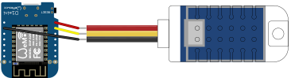

# ESP8266 MQTT Temperature Humidity Sensor

[](https://gitlab.com/timmo/ESP8266-MQTT-Temperature-Humidity-Sensor/commits/master)

ESP8266 MQTT Temperature Humidity Sensor

## Hardware Example

<!--  -->

## Software Setup

- Using Atom or VS Code, install [Platform IO](https://platformio.org/platformio-ide)
- Once setup, install the `esp8266` embedded platform
- Rename `src/setup-template.h` to `src/setup.h` and add your network, MQTT and lighting setup information. Take note of the `deviceName` you set. You will need this later to subscribe to MQTT messages.
- Build the project (Ctrl+Alt+B) and check for any errors

  > If the build produces an error referencing dependencies, You will need to manually install these libraries:
  - ArduinoJson
  - PubSubClient

- Upload to your board of choice (Ctrl+Alt+U). This project was created specifically for the `Wemos D1 Mini` but can be configured to work with another WiFi board (`NodeMCU` etc.) with some tinkering.

## Example Home Assistant Configuration

```yaml
```
